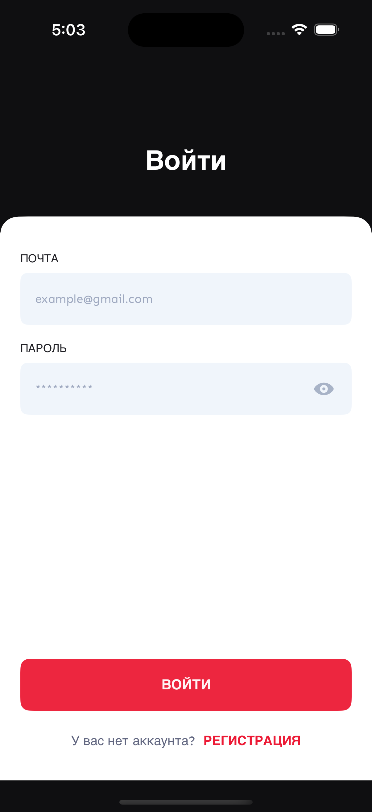
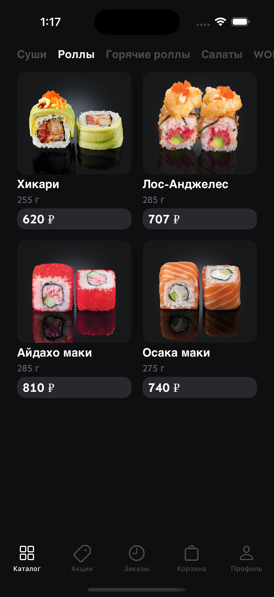
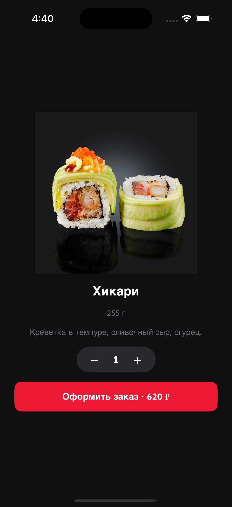
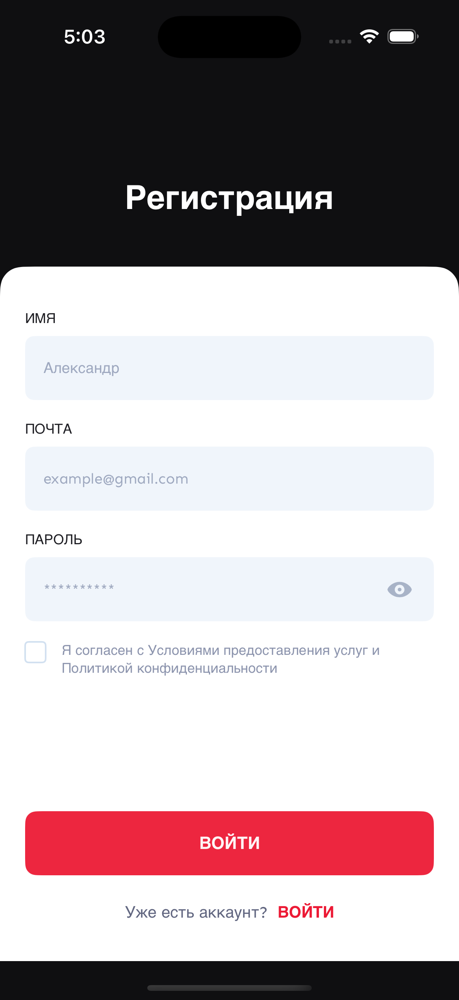
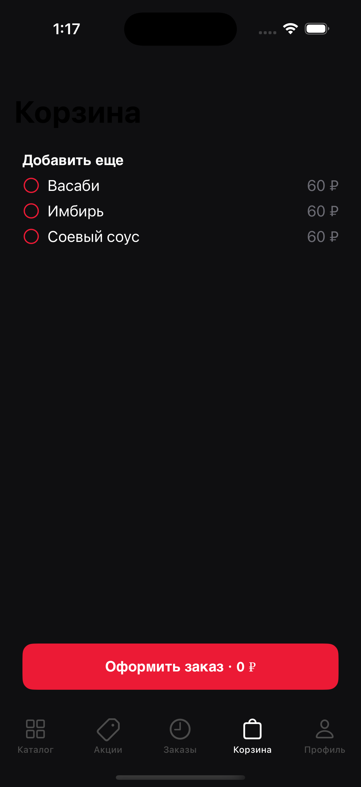
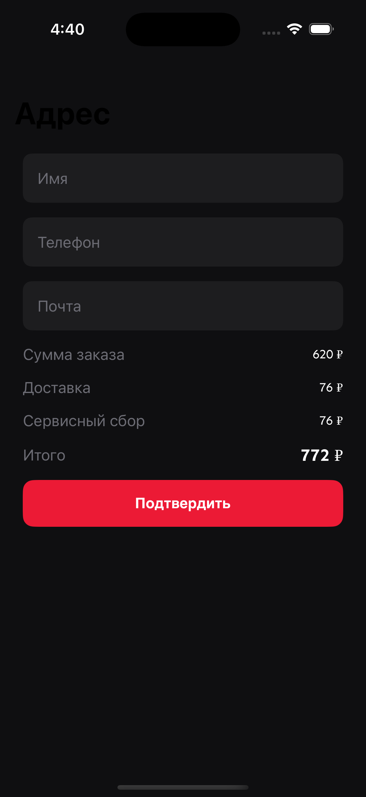
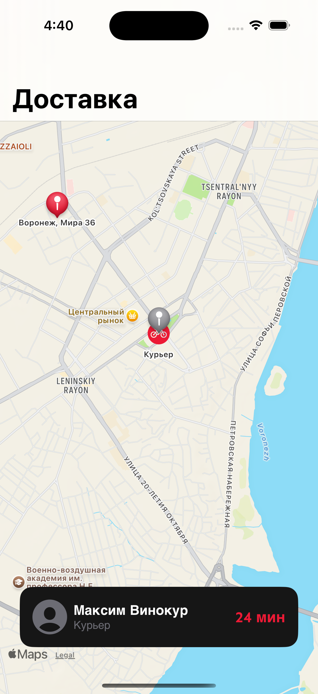
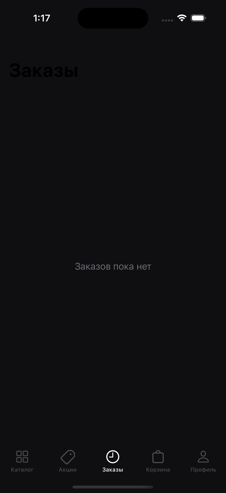
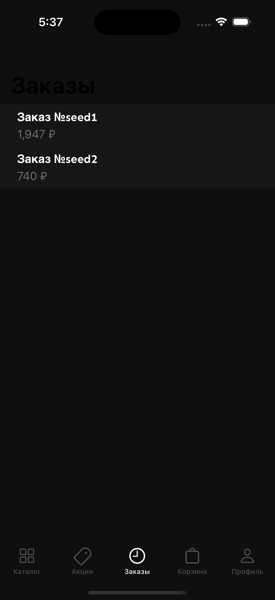
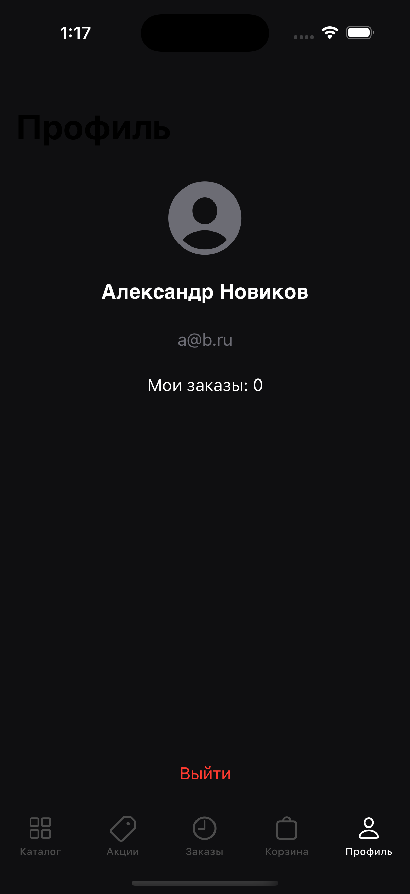

# Sushi Garden Android

A pixel-perfect Russian-language sushi delivery Android app ported from iOS, built with Jetpack Compose. Matches the same Figma design — dark background, red accents, Sen typography — with full checkout → live-tracking → order history flow.

---

## Screenshots

| Регистрация | Войти | Catalog |
|-------|-------|---------|
|  |  |  |

| Product Detail | Promotions | Cart (filled) |
|----------------|------------|---------------|
|  |  |  |

| Cart (empty) | Checkout | Live Tracking |
|--------------|----------|---------------|
|  |  |  |

| Orders (empty) | Orders (filled) | Profile |
|----------------|-----------------|---------|
|  |  |  |


---

## Tech Stack

| Layer | Technology |
|-------|-----------|
| UI | Jetpack Compose (Material3 with Figma token overrides) |
| Architecture | MVVM + ViewModel + StateFlow + coroutines |
| DI | Hilt |
| Auth | Firebase Auth KTX (same project as iOS) |
| Persistence | Room (order history) |
| Maps | Google Maps Compose SDK |
| Images | Coil Compose |
| Navigation | Navigation Compose (NavHost + BottomNavigation) |
| Fonts | Sen (Regular + Bold) bundled |
| Build | Gradle Kotlin DSL, Kotlin 2.0, AGP 8.7 |
| Min SDK | 26 · Target SDK 36 |
| Tests | JUnit4 + MockK + Compose UI Test |

---

## Architecture

### Layer overview

```
┌──────────────────────────────────────────────┐
│              SushiGardenApp                    │
│         (@HiltAndroidApp + Firebase)           │
└──────────────────┬───────────────────────────┘
                   │
┌──────────────────┴───────────────────────────┐
│               MainActivity                     │
│         SushiGardenNavHost                     │
├──────────────────────────────────────────────┤
│         AuthGraph (not authenticated)          │
│              AuthScreen                        │
│         ┌──────────────────────────────┐      │
│         │  Register / Login            │      │
│         └──────────────────────────────┘      │
│                                               │
│         MainGraph (authenticated)              │
│         Scaffold + NavigationBar (5 tabs)     │
│         ┌──────────────────────────────┐      │
│         │  NavHost                      │      │
│         │   CatalogScreen (Tab 0)       │      │
│         │   PromotionsScreen (Tab 1)    │      │
│         │   OrdersScreen (Tab 2)        │      │
│         │   CartScreen (Tab 3)          │      │
│         │   ProfileScreen (Tab 4)       │      │
│         └──────────────────────────────┘      │
└──────────────────────────────────────────────┘
```

### MVVM per feature

```
Screen (@Composable)
  └── collectAsState() ← ViewModel (StateFlow<UiState>)
                               └── Service interfaces (Hilt-injected)
                                     ├── AuthService
                                     ├── MenuRepository
                                     ├── CartService
                                     ├── OrderDao
                                     └── CourierSimulator
```

### Authentication flow

```
App launch
  │
  ├─ authService.currentUser != null ──▶ MainGraph (bottom nav)
  │
  └─ null ──▶ AuthGraph
                  │
                  ├─ Register: name + email + password + consent checkbox
                  └─ Login:    email + password
                          │
                    Firebase Auth (prod) / FakeAuthService (debug/UI test)
                          │
                    navigate to MainGraph
```

### Checkout → Tracking flow

```
CartScreen
  │  user taps "Оформить заказ"
  ▼
CheckoutScreen  (name / phone / email fields + fee summary)
  │  vm.placeOrder() →
  │    OrderDao.insertOrder(orderEntity)  ←─ Room write
  │    cartService.clear()
  │    isSuccess = true
  ▼
TrackingScreen
  │
  ├─ Google Maps with markers (restaurant, destination, courier)
  └─ CourierSimulator (coroutine-based, ticks every 1s)
          │
          └─ StateFlow<CourierState>
                progress, etaSeconds, isDelivered
```

### Data persistence

```
OrderDao (Room)
  SushiGardenDatabase
    └─ OrderEntity (@Entity)
           id, createdAt, totalRub, linesJson
           │
           Gson serialization ◀──▶ [OrderLine]

InMemoryCartService (StateFlow)
    items: StateFlow<List<CartItem>>
    selectedAddOns: StateFlow<Set<AddOn>>
    totalRub: StateFlow<Int>  (derived from combine(items, addOns))
```

---

## Project Structure

```
app/src/main/java/com/baha/sushigarden/
├── SushiGardenApp.kt           @HiltAndroidApp entry point
├── MainActivity.kt             Single activity, Compose host
│
├── ui/
│   └── designsystem/
│       ├── Color.kt            Figma color tokens
│       ├── Typography.kt       Sen font + semantic styles
│       ├── Spacing.kt          Spacing constants
│       └── Theme.kt            Material3 theme (dark, Figma overrides)
│
├── features/
│   ├── auth/                   AuthScreen + AuthViewModel
│   ├── catalog/                CatalogScreen + CatalogViewModel
│   ├── productdetail/          ProductDetailScreen + ViewModel
│   ├── cart/                   CartScreen + CartViewModel
│   ├── checkout/               CheckoutScreen + CheckoutViewModel
│   ├── tracking/               TrackingScreen + TrackingViewModel
│   ├── orders/                 OrdersScreen + OrderDetailScreen + ViewModel
│   ├── promotions/             PromotionsScreen + PromotionsViewModel
│   └── profile/                ProfileScreen + ProfileViewModel
│
├── data/
│   ├── models/                 Product, CartItem, Order, AddOn, etc.
│   └── services/
│       ├── auth/               AuthService, FirebaseAuthService, FakeAuthService
│       ├── catalog/            MenuRepository, LocalMenuRepository
│       ├── cart/               CartService, InMemoryCartService
│       ├── orders/             OrderDao, SushiGardenDatabase
│       └── delivery/           CourierSimulator, FieldValidators
│
├── di/
│   └── AppModule.kt           Hilt bindings
│
└── navigation/
    ├── NavGraph.kt             Screen sealed class + NavHost
```

---

## Features

### 10 screens across 5 tabs + auth gate

| # | Screen | Tab / Entry | Key elements |
|---|--------|-------------|--------------|
| 1 | Регистрация | Auth gate | Name, email, password, consent checkbox, red button |
| 2 | Войти | Auth gate toggle | Email, password, show-password toggle |
| 3 | Каталог | Tab 1 | Category pills (Суши/Роллы/Горячие/Салаты/WOK), 2-column product grid |
| 4 | Детали продукта | Tap product card | Large image, qty stepper, add-to-cart CTA |
| 5 | Акции | Tab 2 | Promo banner images |
| 6 | Заказы | Tab 3 | Order history list + empty state |
| 7 | Корзина | Tab 4 | Line items, qty steppers, add-ons, total, checkout button |
| 8 | Оформление заказа | Cart → Checkout | Name/phone/email fields, fee summary, confirm |
| 9 | Отслеживание | Checkout confirm | Maps markers, courier card, ETA countdown |
| 10 | Профиль | Tab 5 | Avatar, name, email, editable phone, logout |

### Menu data (hardcoded)

| Product | Category | Price | Weight |
|---------|----------|-------|--------|
| Хикари | Роллы | 620 ₽ | 255g |
| Лос-Анджелес | Роллы | 707 ₽ | 285g |
| Айдахо маки | Роллы | 810 ₽ | 285g |
| Осака маки | Роллы | 740 ₽ | 275g |
| Суши с лососем | Суши | 120 ₽ | 35g |
| Суши с угрём | Суши | 150 ₽ | 35g |
| Эби темпура | Горячие роллы | 690 ₽ | 260g |
| Чука салат | Салаты | 320 ₽ | 150g |
| Удон с курицей | WOK | 450 ₽ | 350g |

**Add-ons:** Васаби (60 ₽), Имбирь (60 ₽), Соевый соус (60 ₽)

### Design tokens (from Figma)

| Token | Value |
|-------|-------|
| Background | `#0F0F11` |
| Tab bar / card | `#161616` / `#292830` |
| Accent red | `#EC1A35` |
| Primary text | `#FFFFFF` |
| Secondary text | `#6C6C74` |
| Inactive icon | `#4C4C4C` |
| Card corner radius | `12.4dp` |
| Font | Sen Regular / Sen Bold |

---

## Setup

### Prerequisites

- JDK 17+
- Android SDK (API 36)
- Android emulator or device

### Steps

```bash
git clone <repo>
cd sushi-garden-android-deepseek

# For Firebase Auth, add (optional — app runs with FakeAuthService without it):
#   app/google-services.json    ← Firebase credentials

./gradlew assembleDebug
adb install -r app/build/outputs/apk/debug/app-debug.apk
```

> **Without `google-services.json`** the app uses `FakeAuthService` with a pre-seeded demo user (Александр Новиков). All features work locally. To switch to real Firebase Auth, place `google-services.json` in `app/` and update `AppModule.kt` to bind `FirebaseAuthService`.

### Running on emulator

```bash
source "$HOME/.zshrc"
emulator -avd Pixel_8_API_36 &
adb wait-for-device
./gradlew installDebug
```

---

## Testing

### Unit tests (JUnit4 + MockK)

```bash
./gradlew testDebugUnitTest
```

All unit tests pass: `AuthViewModel`, `CatalogViewModel`, `CartService`, `FieldValidators`, `MenuRepository`.

### UI tests (Compose UI Test)

```bash
# Ensure emulator is running
./gradlew connectedDebugAndroidTest
```

Every screen has a dedicated UI test class covering all flows:

| Screen | Flows covered |
|--------|--------------|
| Auth | Register success, disabled without consent, invalid email, short password, toggle to login, login with wrong credentials |
| Catalog | Category pills displayed, product grid, category switch |
| Cart (empty) | Empty state visible |
| Cart (filled) | Items displayed, checkout button visible |
| Checkout | Fields and fee summary visible |
| Orders (empty) | Empty state visible |
| Profile | Logout button visible |
| Promotions | Screen loads |
| Tracking | Courier name visible |

---

## Out of scope (v1)

- Real payment processing (UI only)
- Live courier tracking / real backend
- Push notifications
- Firestore / remote menu
- Localization beyond Russian

---

## iOS reference

The Android app is a pixel-for-pixel port of:
`~/Desktop/llm-ai-projects/sushi-garden-ios`

Same features, same data, same Figma design at:
`https://www.figma.com/design/wOK1MMzuJZF3pIOZhGHpY9/Error-Nil.-Apps?node-id=1-6`
